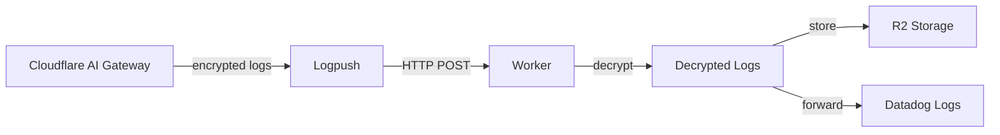

# Cloudflare AI Gateway Logpush to Datadog Decrypter

Cloudflare Worker that decrypts AI Gateway logs, stores them in R2, and forwards them to Datadog.

## Overview

This Worker receives encrypted logs from Cloudflare AI Gateway via Logpush, decrypts the sensitive fields (Metadata, RequestBody, ResponseBody), stores the decrypted logs in R2 for archival, and forwards the decrypted logs to Datadog Logs API.

## Architecture



## Features

- 🔐 Decrypts RSA-OAEP + AES-GCM encrypted fields from AI Gateway logs
- 📦 Stores decrypted logs in R2 for compliance/analysis
- 📊 Forwards decrypted logs to Datadog with proper tagging (excluding response content for privacy)
- 🔒 Secure API key management using Worker secrets
- 🗜️ Handles gzip-compressed log batches
- ⚡ Processes multiple log entries per request (NDJSON format)

### Available Fields

AI Gateway Logpush currently provides these fields:
- **Unencrypted**: `Cached`, `Endpoint`, `Gateway`, `Model`, `Provider`, `RateLimited`, `StatusCode`
- **Encrypted**: `Metadata`, `RequestBody`, `ResponseBody`

**Notes**: 
- Performance metrics like `duration`, `tokens_in`, `tokens_out` are available through the AI Gateway API but **are NOT included in Logpush exports**. To access these metrics, you would need to query the AI Gateway API directly.
- For privacy, the `content` field in `ResponseBody` is **excluded** when forwarding to Datadog, but is preserved in R2 storage.

## Prerequisites

- Cloudflare account with AI Gateway enabled
- Datadog account with Logs API access
- RSA key pair for encryption/decryption
- Node.js 18+ and pnpm

## Setup

### 1. Install dependencies

```bash
pnpm install
```

### 2. Create R2 bucket

```bash
# Create R2 bucket for storing logs
wrangler r2 bucket create ai-gateway-logs
```

### 3. Configure secrets

```bash
# Generate a secure fixed-length token (recommended: 32 bytes base64)
LOGPUSH_TOKEN=$(openssl rand -base64 32 | tr -d '\n')
echo "Generated token: $LOGPUSH_TOKEN"

# Set the token as a secret
echo $LOGPUSH_TOKEN | wrangler secret put LOGPUSH_TOKEN

# Set your RSA private key (paste the entire key including headers)
wrangler secret put PRIVATE_KEY

# Set your Datadog API key
wrangler secret put DD_API_KEY

# (Optional) Set custom Datadog endpoint if not using US1
# wrangler secret put DD_LOGS_ENDPOINT
```

### 4. Configure AI Gateway

1. Generate RSA key pair:
```bash
# Generate private key
openssl genrsa -out private_key.pem 2048

# Extract public key
openssl rsa -in private_key.pem -pubout -out public_key.pem
```

2. Upload `public_key.pem` to AI Gateway settings

3. Configure Logpush destination:

**Important**: Do NOT use the Datadog connector in Cloudflare Logpush, as it requires your DD_API_KEY to be exposed in the Logpush configuration. Instead, use a custom HTTP endpoint to keep your API key secure in Worker secrets.

**Via Cloudflare Dashboard:**
1. Go to your Zone → Analytics → Logs → Logpush
2. Click "Create a Logpush job"
3. Select dataset: AI Gateway logs
4. **Select destination type**: Choose "HTTP" (NOT "Datadog")
5. Configure the HTTP destination:
   - URL: `https://<YOUR-WORKER>.<SUBDOMAIN>.workers.dev/logs`
   - Add authentication header by appending to URL:
     ```
     https://<YOUR-WORKER>.<SUBDOMAIN>.workers.dev/logs?header_X-Logpush-Token=<LOGPUSH_TOKEN>
     ```
6. Select fields to include (or use all fields)
7. Complete the setup

**Via API:**
```bash
# Create Logpush job using the API
curl -X POST "https://api.cloudflare.com/client/v4/zones/<ZONE_ID>/logpush/jobs" \
  -H "Authorization: Bearer <API_TOKEN>" \
  -H "Content-Type: application/json" \
  -d '{
    "name": "ai-gateway-to-datadog",
    "dataset": "ai_gateway_log",
    "destination_conf": "https://cf-aigw-logpush-dd-decripter.polyfill.workers.dev/logs?header_X-Logpush-Token=YOUR_LOGPUSH_TOKEN",
    "enabled": true
  }'
```

**Why not use Datadog connector?**
- Datadog connector requires DD_API_KEY in the destination URL
- This exposes your API key in Cloudflare's configuration
- Using HTTP endpoint + Worker keeps your DD_API_KEY secure in Worker secrets

### 5. Deploy

```bash
pnpm run deploy
```

## Development

```bash
# Start local development server
pnpm run dev

# View logs in real-time during development
pnpm run dev --log-level debug

# Run tests
pnpm test

# Type check
pnpm run cf-typegen
```

## Configuration

### Environment Variables (Secrets)

- `LOGPUSH_TOKEN`: Shared secret for authenticating Logpush requests (uses constant-time comparison)
- `PRIVATE_KEY`: RSA private key for decrypting log fields
- `DD_API_KEY`: Datadog API key for log ingestion
- `DD_LOGS_ENDPOINT` (optional): Datadog logs endpoint URL. Defaults to `https://http-intake.logs.datadoghq.com/api/v2/logs` (US1)

### R2 Storage

- `LOG_BUCKET`: R2 bucket binding for storing decrypted logs
- Logs are stored in `YYYY-MM-DD/timestamp_uuid.json` format
- Each log file contains only decrypted entries (encrypted data is excluded to save space)

### Headers

- `X-Logpush-Token`: Must match `LOGPUSH_TOKEN` secret (uses constant-time comparison for security)

### Datadog Configuration

The Worker sends logs to Datadog with the following attributes:
- `ddsource`: cloudflare
- `service`: ai-gateway  
- `host`: ai-gateway-host
- `ddtags`: env:prod,team:infra

Modify these in `src/index.ts` as needed.

### Datadog Regional Endpoints

Set `DD_LOGS_ENDPOINT` based on your Datadog region:

- **US1**: `https://http-intake.logs.datadoghq.com/api/v2/logs` (default)
- **US3**: `https://http-intake.logs.us3.datadoghq.com/api/v2/logs`
- **US5**: `https://http-intake.logs.us5.datadoghq.com/api/v2/logs`
- **EU**: `https://http-intake.logs.datadoghq.eu/api/v2/logs`
- **AP1**: `https://http-intake.logs.ap1.datadoghq.com/api/v2/logs`
- **US1-FED**: `https://http-intake.logs.ddog-gov.com/api/v2/logs`

## Debugging

### View Logs

```bash
# Local development logs
pnpm run dev

# Production logs (real-time)
wrangler tail

# Production logs with filters
wrangler tail --search "Logpush payload"
```

### Production Deployment

**⚠️ Important**: The current implementation includes debug logging for troubleshooting. For production use:

1. **Remove all `console.log` statements** from `src/index.ts` to:
   - Prevent sensitive data exposure in logs
   - Avoid hitting Cloudflare's 256KB log size limit
   - Improve performance

2. **Or create a production build** with logging disabled:
   ```typescript
   const DEBUG = false; // Set to false for production
   if (DEBUG) console.log(...);
   ```

### R2 Storage Access

View stored logs in R2:
- **Cloudflare Dashboard**: R2 → `ai-gateway-logs` bucket
- **File structure**: `YYYY-MM-DD/timestamp_uuid.json`
- Each file contains decrypted log entries and any decryption errors

## Testing

### Local Testing

```bash
# Test with sample encrypted payload
curl -X POST http://localhost:8787/ingest \
  -H "Content-Type: application/json" \
  -H "X-Logpush-Token: your-test-token" \
  -d @test-payload.json
```

### Production Testing

```bash
# Test deployed Worker
curl -X POST https://your-worker.subdomain.workers.dev/ingest \
  -H "Content-Type: application/json" \
  -H "X-Logpush-Token: your-token" \
  -H "DD-API-KEY: your-datadog-api-key" \
  -d '{}'
```

## Security Considerations

- Always use HTTPS for the Worker endpoint
- Rotate `LOGPUSH_TOKEN` regularly
- Keep `PRIVATE_KEY` secure and never commit it
- Monitor for unauthorized access attempts
- Use Cloudflare Access or similar for additional protection if needed

## Troubleshooting

### Common Issues

1. **401 Unauthorized**: Check `X-Logpush-Token` header matches secret
2. **400 Bad Request**: Ensure `DD-API-KEY` header is present
3. **500 Internal Server Error**: Check Worker logs for decryption errors
4. **Datadog not receiving logs**: Verify API key and endpoint region

### Debug Mode

Enable debug logging by checking Worker logs in Cloudflare dashboard:
```
wrangler tail
```

## License

MIT